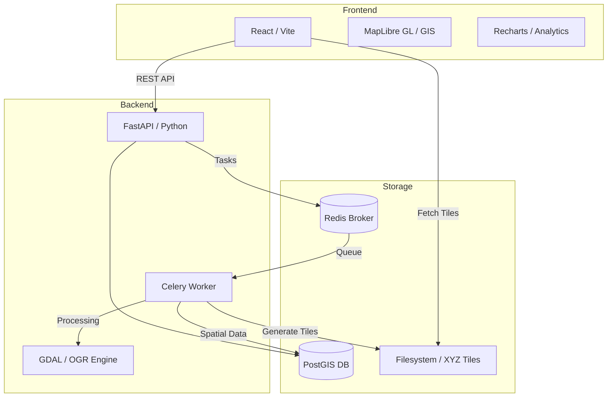

# 🌲 Plantation & Tree Analytics Dashboard

A cloud-based GIS platform for precision forestry management, automating the processing and visualization of large-scale plantation data.

---

## 🏗️ System Architecture

The platform follows a modern microservices architecture, optimized for handling heavy GIS spatial data and raster processing.



### 🛰️ GIS Processing Pipeline
1.  **Ingestion**: Admin uploads Geospatial files (Shapefiles, GeoTIFFs).
2.  **Processing (Celery + GDAL)**:
    -   **Vector Data**: Boundary and Tree shapefiles are simplified and reprojected using `Geopandas` and `Shapely`, then stored in **PostGIS**.
    -   **Raster Data**: Orthophotos and Terrain models (DTM/DSM) are reprojected (EPSG:3857) and converted into **XYZ Tile Layers** using `gdal2tiles`.
3.  **Visualization**: The frontend client fetches vector data for analytics and streams raster tiles directly to the MapLibre engine for high-performance mapping.

---

## 🛠️ Tech Stack

### Frontend
- **Framework**: React 18 (Vite)
- **Mapping**: MapLibre GL JS
- **Visualization**: Recharts
- **Styling**: Vanilla CSS (Custom UI Components)
- **Networking**: Axios

### Backend
- **Framework**: FastAPI (Asynchronous Python)
- **Database**: PostgreSQL with PostGIS extension
- **ORM**: SQLAlchemy + GeoAlchemy2
- **Background Tasks**: Celery + Redis
- **Auth**: JWT (JSON Web Tokens) with Passlib (Bcrypt)

### DevOps & Tools
- **Containerization**: Docker & Docker Compose
- **GIS Engines**: GDAL, OGR, Geopandas, Rasterio
- **Server**: Uvicorn (Backend), Nginx (Frontend Deployment)

---

## 🚀 Quick Start (Recommended)

The easiest way to run the entire stack is using **Docker Compose**. This ensures all GIS dependencies (GDAL, PostGIS) and services (Redis, Celery) are correctly configured.

### Prerequisites
- [Docker](https://docs.docker.com/get-docker/)
- [Docker Compose](https://docs.docker.com/compose/install/)

### Running the Application

1.  **Clone/Navigate** to the project directory:
    ```bash
    cd /home/lansub/Desktop/gis-gui
    ```

2.  **Start all services**:
    ```bash
    docker compose up --build -d
    ```

3.  **Access the application**:
    - **Frontend**: [http://localhost:5173](http://localhost:5173)
    - **Backend API**: [http://localhost:8000/api/docs](http://localhost:8000/api/docs) (Swagger UI)

### 🔐 Default Credentials
The database is auto-seeded with test accounts:
- **Admin**: `admin` / `admin123`
- **Client**: `client` / `client123`

---

## 📂 Project Structure

```bash
├── backend/            # FastAPI Application
│   ├── app/            # Core logic (models, schemas, routers)
│   ├── migrations/     # Alembic DB migrations
│   └── Dockerfile      # Production build for Backend
├── frontend/           # React Application
│   ├── src/            # Components, Hooks, API, Pages
│   ├── public/         # Static assets
│   └── Dockerfile      # Nginx-based production build
├── docker-compose.yml  # Multi-container orchestration
└── README.md           # This file
```
